# Blood Smear Enhancement — CellPose Pipeline

Synthetic Wright–Giemsa rendering of peripheral blood smear images.

| | |
|---|---|
| **Input** | raw / poorly stained / lavender smear frame |
| **Output** | white background · pale-red RBCs · purple WBC nucleus with pale lavender rim · dark-purple platelet dots |
| **Segmentation** | CellPose `cyto3` (GPU) |
| **Everything else** | pure OpenCV / NumPy colour math |

```bash
python3 cellpose.py input.png -r ref1.png -r ref2.png -s 1.25 -o result.jpeg
```

---

## Pipeline Flow

```mermaid
flowchart TD
    IN(["INPUT — raw BGR smear image"])
    S1["<b>STEP 1 · Denoise + Flatten</b><br/>bilateral filter → LAB L-channel illumination flatten"]
    S2["<b>STEP 2 · CellPose Segmentation</b><br/>cyto3 GPU @960px → nearest-upscale → labels"]
    S3["<b>STEP 3 · Build Cell Masks</b><br/>fit ellipse per label → fill_mask · border_mask · tiny_mask<br/>fill_safe = fill_mask dilated 3px"]
    S4["<b>STEP 4 · Platelet Detect — PRE-match</b><br/>saturation spike in cell-free gap → platelet_pre"]
    S5["<b>STEP 5 · WBC Detect — PRE-match</b><br/>adaptive threshold vs this slide's own RBCs → wbc_pre"]
    S6["<b>STEP 6 · Colour Matching</b><br/>LAB mean/std transfer to reference<br/>no -r → 2–98 percentile levels stretch"]
    S7["<b>STEP 7 · WBC Detect — POST-match</b><br/>refines wbc_pre only, cannot add new nuclei → wbc_mask"]
    S8["<b>STEP 8 · Platelet Detect — POST-match</b><br/>dark AND saturated in gap → platelet_post"]
    S9["<b>STEP 9 · Merge Platelet Masks</b><br/>platelet_pre + platelet_post + tiny_mask → platelet_prot"]
    S10["<b>STEP 10 · Background Whitening</b><br/>88% pull to white, blocked by cells / platelets / WBC"]
    S11["<b>STEP 11 · Draw Ellipse Borders</b><br/>soft darkened ring around each cell"]
    S12["<b>STEP 12 · RBC Tint</b><br/>pull cell interiors toward pale red, hue 177"]
    S13["<b>STEP 13 · RBC Clean</b><br/>kill grey/blue cast · saturation floor · value floor"]
    S14["<b>STEP 14 · Platelet Boost</b><br/>60% pull to dark purple, hue 130"]
    S15["<b>STEP 15 · Haze Kill</b><br/>near-white low-sat pixels forced to pure white"]
    S16["<b>STEP 16 · Global Saturation Boost</b><br/>optional, -s flag"]
    S17["<b>STEP 17 · RBC Reference Clamp</b><br/>hue 172 · sat clamped 40–82 · value floor 178"]
    S18["<b>STEP 18 · Suppress Stray Violet</b><br/>leftover lavender outside WBC/platelet zones → white or red"]
    S19["<b>STEP 19 · WBC Passthrough</b><br/>nucleus composited back from the ORIGINAL image, untouched"]
    S20["<b>STEP 20 · Perinuclear Cytoplasm Rim</b><br/>25px pale lavender ring around the nucleus"]
    OUT(["OUTPUT — enhanced smear image"])

    IN --> S1 --> S2 --> S3 --> S4 --> S5 --> S6 --> S7
    S7 --> S8 --> S9 --> S10 --> S11 --> S12 --> S13 --> S14
    S14 --> S15 --> S16 --> S17 --> S18 --> S19 --> S20 --> OUT

    style IN fill:#e8f0fe,stroke:#4285f4,stroke-width:2px
    style OUT fill:#e6f4ea,stroke:#34a853,stroke-width:2px
    style S2 fill:#fef7e0,stroke:#f9ab00
    style S6 fill:#fef7e0,stroke:#f9ab00
    style S19 fill:#fce8e6,stroke:#ea4335
```



<details>
<summary><b>Plain-text version of the same flow</b> (click to expand)</summary>

```text
              INPUT  (raw BGR smear image)
                       |
                       v
STEP 1   DENOISE + FLATTEN
         bilateral filter -> LAB L-channel illumination flatten
                       |
                       v
STEP 2   CELLPOSE SEGMENTATION
         cyto3 GPU @960px -> nearest-upscale to full res -> labels
                       |
                       v
STEP 3   BUILD CELL MASKS
         fit ellipse per label
         -> fill_mask / border_mask / tiny_mask
         -> fill_safe = fill_mask dilated 3px
                       |
                       v
STEP 4   PLATELET DETECT  (PRE-match)
         saturation spike in cell-free gap -> platelet_pre
                       |
                       v
STEP 5   WBC DETECT  (PRE-match)
         adaptive threshold vs this slide's own RBCs -> wbc_pre
                       |
                       v
STEP 6   COLOUR MATCHING
         LAB mean/std transfer to reference(s)
         (no -r  ->  2-98 percentile levels stretch instead)
                       |
                       v
STEP 7   WBC DETECT  (POST-match)
         refines wbc_pre only, cannot add new nuclei -> wbc_mask
                       |
                       v
STEP 8   PLATELET DETECT  (POST-match)
         dark AND saturated in gap -> platelet_post
                       |
                       v
STEP 9   MERGE PLATELET MASKS
         platelet_pre + platelet_post + tiny_mask -> platelet_prot
                       |
                       v
STEP 10  BACKGROUND WHITENING
         88% pull to white, blocked by cells / platelets / WBC
                       |
                       v
STEP 11  DRAW ELLIPSE BORDERS
         soft darkened ring around each cell
                       |
                       v
STEP 12  RBC TINT
         pull cell interiors toward pale red, hue 177
                       |
                       v
STEP 13  RBC CLEAN
         kill grey/blue cast, saturation floor, value floor
                       |
                       v
STEP 14  PLATELET BOOST
         60% pull to dark purple, hue 130
                       |
                       v
STEP 15  HAZE KILL
         near-white low-sat pixels forced to pure white
                       |
                       v
STEP 16  GLOBAL SATURATION BOOST
         optional, -s flag
                       |
                       v
STEP 17  RBC REFERENCE CLAMP
         hue 172, sat clamped 40-82, value floor 178
                       |
                       v
STEP 18  SUPPRESS STRAY VIOLET
         leftover lavender outside WBC/platelet zones -> white or red
                       |
                       v
STEP 19  WBC PASSTHROUGH
         nucleus composited back from the ORIGINAL image, untouched
                       |
                       v
STEP 20  PERINUCLEAR CYTOPLASM RIM
         25px pale lavender ring around the nucleus
                       |
                       v
              OUTPUT  (enhanced smear image)
```

</details>

---

## CLI Options

| Flag | Default | Meaning |
|---|---|---|
| `input` | — | Source smear image |
| `-o`, `--output` | `<input>_cp.jpeg` | Output path |
| `-r`, `--reference` | none | Colour reference — repeatable, LAB stats averaged |
| `-d`, `--max-dim` | `960` | CellPose inference size (lower = faster) |
| `-q`, `--quality` | `95` | JPEG quality |
| `-s`, `--saturation` | `1.0` | Global saturation multiplier |

Without `-r`, Step 6 falls back to a 2–98 percentile levels stretch.

---

## Why the Ordering Matters

### Platelets are detected *before* colour matching — Step 4

Post-match-only detection caused a destructive feedback loop on lavender slides: loose thresholds flagged background noise as platelets → whitening was blocked → the lavender background survived → it was detected as *even more* platelets → hundreds of false blue dots.

Pre-match, platelets sit at `sat ≈ 90` against a background of `≈ 25–30`, so the adaptive threshold `max(20, median_gap_sat × 1.6)` separates them cleanly.

### `fill_mask` is dilated ~3px before gap computation — Step 3

Pixels just outside a fitted ellipse are cell-border pixels — also saturated — and would otherwise register as platelets.

### WBC thresholds are slide-relative, not fixed — Step 5

`satThr = max(70, rbc_sat × 1.5)`. Value is deliberately **not** used as a discriminator: on a lavender slide the nucleus is *brighter* than the RBCs (V 224 vs 200), on a pink slide it is darker. Saturation separates reliably in both cases.

### Post-match WBC detection can only refine, never add — Step 7

It is multiplied by a 21×21 dilation of `wbc_pre`. Without this gate, RBC clusters that the adaptive filter correctly rejected come back as false WBCs.

### Stray violet is suppressed before the WBC passthrough — Step 18

Red-forcing steps only run *inside* the cell ellipses, and whitening only pulls the gap 88% toward white. Cells CellPose missed or merged in dense clumps fall into neither set and keep their lavender. This step catches them globally — bright violet is desaturated to white, dark violet is forced into the RBC red envelope.

### The WBC is restored from the ORIGINAL image — Step 19

No stage — denoise, flatten, matching, whitening, tint, borders, saturation — survives on those pixels, so the leucocyte keeps its raw chromatin texture. Only the perinuclear rim is synthesised afterwards.

---

## Tuning Knobs

| Behaviour | Function | Knob |
|---|---|---|
| Platelet size cutoff | `build_masks` | `tiny_thr = max(80, 0.30 × median_area)` |
| Border ring drawn | `build_masks` | `max_ellipse_area = 4000` |
| Pre-match platelet sensitivity | `find_platelet_mask_prematch` | `blob_sat_thr = max(45, bg_sat × 2.0)`, area `4–300` |
| WBC strictness | `find_wbc_mask_prematch` | sat multiplier `1.5` · solidity `0.72` · `stdV ≤ 24` |
| Background whiteness | Step 10 | `blend = bg_mask × 0.88` |
| WBC halo protection | Step 10 | `wbc_guard` 41×41 dilate · `σ=9` · weight `0.85` |
| RBC final colour | `match_rbc_to_reference` | `hue=172` · `sat 40–82` · `val_floor=178` |
| Platelet visibility | `boost_platelets` | `pull=0.60` · `hue=130` · `sat=160` · `V×0.75` |
| Cytoplasm rim | `tint_perinuclear_cytoplasm` | `reach=25` · `hue=133` · `sat_mul=0.35` · `lighten=0.30` |

---

## Notes on the Current File

- The module docstring lists an 11-step order that predates the post-match platelet and stray-violet stages. **The code is the source of truth.**
- `close_wbc_cell` is defined **twice, identically** — and neither copy is called.
- Not called by `enhance()`: `enhance_wbc`, `build_wbc_cell_mask`, `enhance_wbc_structured`, `find_cyto_mask`, `recolor_wbc`, `close_wbc_cell`, `segment_wbc_cytoplasm`. These are earlier cytoplasm-rendering attempts, superseded by raw passthrough + `tint_perinuclear_cytoplasm`. Safe to delete.
- `wbc_cyto_bin` / `wbc_cyto_soft` / `other_cells` are allocated as zeros and never populated — the WBC region is the nucleus mask only.
- The CellPose model is cached in the module-global `_MODEL`, so a long-lived process pays the load cost once.

---

## Dependencies

```
opencv-python
numpy
scipy
cellpose        # model_type='cyto3', gpu=True
torch           # CUDA build matching your device
```

